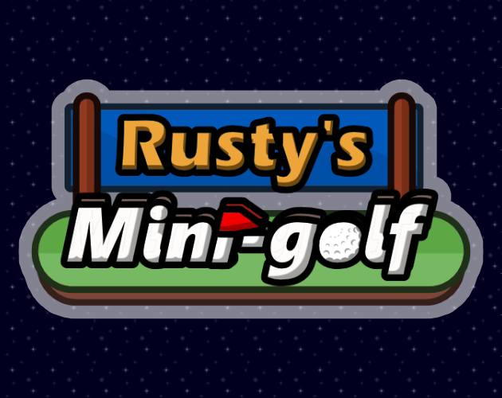
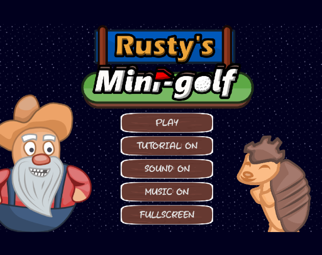
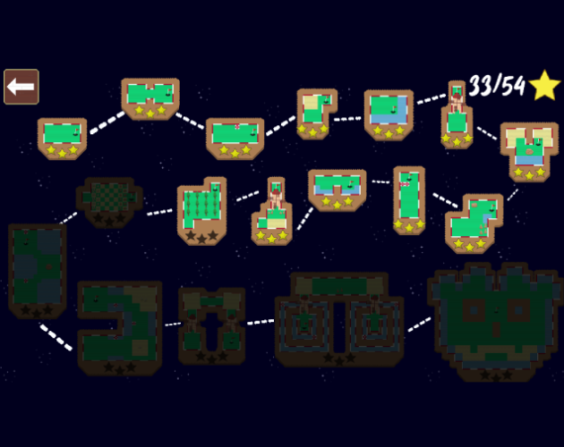
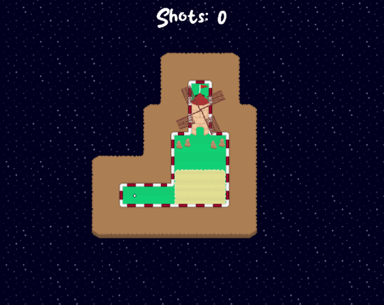
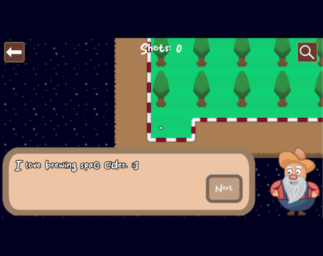

# Rusty's Mini Golf

## About

Rusty's Mini-Golf is a 2D mini-golf game where the aim is to sink the ball in the hole in as few moves as possible. The game features 18 unique levels that ramp up in difficulty as you progress.

The game was made using Godot 4.1, AsePrite, Audacity & FL Studio

## Play

You can play the game directly in your web browser on [itch.io](https://sleepingcolossus.itch.io/golf)

## Learn More

If you'd like to see how the game was made from start to finish then check out this [playlist on YouTube](https://www.youtube.com/playlist?list=PLi18q6YY9ivknv13gQB7Vwl_PRq2-M15s)

## Screenshots

